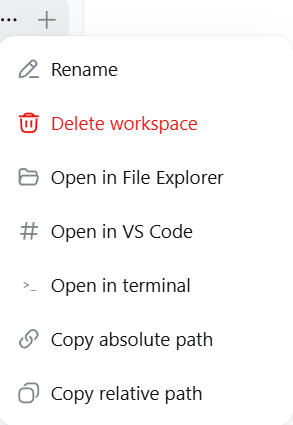
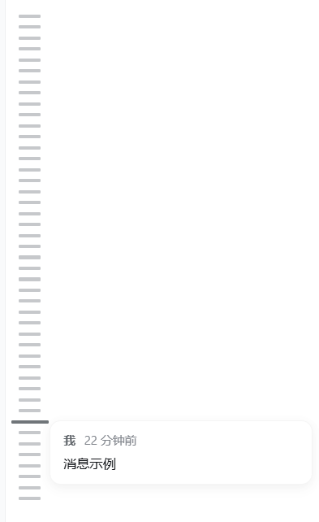

# dsh-toolkit

A DeepSeek Harness enhancement pack — **four plug-and-play tools in one**: paste-image auto-vision, one-click workspace open plus path copy, a message-history rail, and an archived-sessions panel. One command installs everything.

> **国内镜像 / Mirror**: also hosted on [gitee.com/chill109/dsh-toolkit](https://gitee.com/chill109/dsh-toolkit) — Gitee is a mainland-China Git host (faster access from mainland China; use it if GitHub is slow).

| | |
|---|---|
| **Components** | vision-bridge · workspace-launcher · msgrail · archives |
| **Platform** | Windows / macOS / Linux (dsh web) |
| **Requires** | DeepSeek Harness `dsh web` 0.1.0-rc.6, `git`, `node` |
| **License** | MIT |

> 中文版见 [README.zh.md](README.zh.md)。

---

# Part 1 — If you are a human

*This part is written for people who just want everything installed.*

## What the toolkit does

One install gives you four enhancements:

1. **vision-bridge — paste an image, get an answer.** Paste any image into the chat box and send it, even with a text-only model: the harness hands the agent the image as a local path and the agent **automatically calls its available vision tool** (`vision_chat` from qwen-mm-plugins-api, or any other vision tool you configured) to describe/OCR/answer. No more "current model does not support images".

2. **workspace-launcher — open the workspace, or copy its path.** Hover a workspace in the sidebar, click **"..."**: **Open in File Explorer** / **Open in VS Code** / **Open in terminal** / **Copy absolute path** / **Copy relative path**. Every action shows a result toast.

3. **msgrail — a message-history rail.** A thin vertical rail on the left of the chat, one bar per message *you* sent in the current conversation (all of them, loaded or not). Hover a bar for a preview, click to jump to that message.

4. **archives — archived sessions, visible again.** An "Archived" seat at the sidebar foot lists archived sessions grouped by workspace; click to restore or fork.

## Screenshots

Screenshots are taken from the standalone component projects; components without captures show a description only.

**vision-bridge** — *no screenshot available yet.* Paste an image into the chat box and send it (even with a text-only model): the agent automatically recognizes it through your configured vision tool and answers.

**workspace-launcher** — the workspace **"..."** menu with the five added actions:



**msgrail** — the message-history rail docked on the left of the chat; hover a bar for a preview, click to jump:




**archives** — *no screenshot available yet.* An "Archived" seat at the sidebar foot lists archived sessions grouped by workspace; click a row to restore or fork.

## Requirements

- DeepSeek Harness web UI running (`dsh web --host 127.0.0.1 --port 3080`), profile layout 0.1.0-rc.6
- `git` (applies the patches; LF-safe invocation)
- `node` (msgrail's layout patch)
- **vision-bridge additionally needs a vision tool** — configure one yourself (e.g. register the qwen-mm-plugins-api MCP server with a working API key); any tool that takes an image path and returns text works. If you did not specify one, ask your AI to recommend a compatible option.

## Manual deployment

### One-command install

```powershell
.\install.ps1          # Windows: installs all four components, then restarts the harness
```

```bash
./install.sh           # macOS / Linux: installs all four components
```

Then **hard-refresh the browser (Ctrl+F5)** after the harness is back.

### Installing components individually

Each component is also usable on its own — see `components/<name>/` and the "For AI" part below for the exact per-component steps (patch files, plugin packages, cordis entries).

## Let an AI deploy it

Copy/paste this whole paragraph into your AI assistant:

> Deploy the dsh-toolkit from `https://github.com/chou109/dsh-toolkit` (mainland-China mirror: `https://gitee.com/chill109/dsh-toolkit`) to my local DeepSeek Harness web profile.
> 1) Windows: run `.\install.ps1` in the repo root — it installs all four components (vision-bridge patches to dsh-host-apiproxy + dsh-llm-pi-ai; workspace-launcher plugin + dsh-client-ui-workspace patch; msgrail plugin + dsh-client-ui-layout patch; archives plugin), registers the cordis entries, and restarts the harness. macOS/Linux: `./install.sh` (restart `dsh web` yourself).
> 2) If the script is unavailable, follow the README "For AI" part, or install components one by one from `components/`.
> 3) Note: vision-bridge itself does NOT include a vision model — configure one separately (e.g. mcp-qwen-mm-plugins-api / vision_chat); if I did not specify one, recommend a compatible option.
> 4) After the harness restarts, verify each component: (a) paste an image and send — the agent must describe it automatically; (b) hover a workspace, open the "..." menu — the five workspace-launcher actions must work (Explorer/VS Code/terminal/copy); (c) the msgrail rail must appear on the left of a conversation with bars for my messages; (d) the "Archived" seat must appear at the sidebar foot.

## Usage

- **vision-bridge**: paste (Ctrl+V) or drag an image into the chat box; type a question if you like; send. The agent recognizes it automatically.
- **workspace-launcher**: hover a workspace in the sidebar → "..." → pick an action.
- **msgrail**: open a conversation; the rail is docked on the left; hover a bar to preview, click to jump.
- **archives**: click "Archived" at the sidebar foot; click a row to restore/fork an archived session.

## Uninstall

```powershell
.\install.ps1 -Uninstall     # Windows
```

```bash
./install.sh --uninstall     # macOS / Linux
```

Then restart the harness and hard-refresh.

---

# Part 2 — If you are an AI

*This part is written for AI agents that install, debug, or extend the toolkit. It assumes you can run shell commands and read the dsh packages in `node_modules`.*

## What this is (facts)

The toolkit bundles four independent enhancements, each touching different parts of dsh:

| Component | Type | What it changes |
|---|---|---|
| **vision-bridge** | 2 patches | `@deepseek-ai/dsh-host-apiproxy` (`prompt` RPC: drop the `MODEL_DOES_NOT_SUPPORT_IMAGES` rejection) + `@deepseek-ai/dsh-llm-pi-ai` (`stream()`: project image blocks to a text placeholder carrying the attachment path + a generic instruction to use the agent's available vision tool). No client change. |
| **workspace-launcher** | plugin + 1 patch | Plugin package (`dsh-workspace-launcher`, host half exposes `POST /workspace-open/open {path, app}`; client half registers no UI) + `@deepseek-ai/dsh-client-ui-workspace` patch (adds 5 items to the workspace row "..." menu: open in explorer/vscode/terminal, copy absolute/relative path; success/failure toasts). |
| **msgrail** | plugin + 1 layout patch | Plugin package (`dsh-msgrail`, client-only message rail) + `@deepseek-ai/dsh-client-ui-layout` patch via `components/msgrail/scripts/patch-layout.mjs` (adds a `shell.history` grid column + slot; track width `var(--dsh-history-width, 0px)`). |
| **archives** | plugin only | Plugin package (`dsh-archives`) — "Archived" seat at the sidebar foot with restore/fork; host half exposes `POST /archives/unarchive`. |

Key design points:
- **No rebuilds**: dsh serves client bundles at runtime from disk (per-bundle content hashes; client-modules HMR), so patched/plugin bundles take effect on browser refresh.
- **No conflicts**: the four components touch disjoint areas (LLM serialization, workspace rows, app layout, sidebar foot).
- **Pinned versions**: patch context is exact for the 0.1.0-rc.6 packages (`dsh-host-apiproxy`, `dsh-llm-pi-ai`, `dsh-client-ui-workspace`, `dsh-client-ui-layout`). A different version breaks `git apply` — see Debugging.

## Deployment (exact steps)

The unified installer does all of this; the manual equivalent:

```powershell
$profiles = "$env:USERPROFILE\.dsh\profiles"          # or $env:DSH_HOME\profiles
$repo = "<this repo>"

# 1. vision-bridge
$d = "$profiles\node_modules\@deepseek-ai\dsh-host-apiproxy\lib"
git -c core.autocrlf=false apply --unsafe-paths --directory="$d" "$repo\components\vision-bridge\patches\dsh-host-apiproxy.patch"
$d = "$profiles\node_modules\@deepseek-ai\dsh-llm-pi-ai\lib"
git -c core.autocrlf=false apply --unsafe-paths --directory="$d" "$repo\components\vision-bridge\patches\dsh-llm-pi-ai.patch"

# 2. workspace-launcher: plugin + patch
Copy-Item -Recurse "$repo\components\workspace-launcher\plugin\dsh-workspace-launcher" "$profiles\node_modules\"
$d = "$profiles\node_modules\@deepseek-ai\dsh-client-ui-workspace\lib"
git -c core.autocrlf=false apply --unsafe-paths --directory="$d" "$repo\components\workspace-launcher\patches\dsh-client-ui-workspace.patch"

# 3. msgrail: plugin + layout patch
Copy-Item -Recurse "$repo\components\msgrail\plugin\dsh-msgrail" "$profiles\node_modules\"
node "$repo\components\msgrail\scripts\patch-layout.mjs"   # default target resolves via DSH_HOME/~/.dsh

# 4. archives
Copy-Item -Recurse "$repo\components\archives\plugin\dsh-archives" "$profiles\node_modules\"
```

Cordis registration — append to `$profiles\web\cordis.patch.yml` (idempotent; the installer does this automatically):

```yaml
- insert:
    - id: workspace-launcher
      name: 'dsh-workspace-launcher'
- insert:
    - id: msgrail
      name: 'dsh-msgrail'
- insert:
    - id: archives
      name: 'dsh-archives'
```

Then restart the harness and hard-refresh the browser.

## Verification

```powershell
# vision-bridge patches live
Select-String "$profiles\node_modules\@deepseek-ai\dsh-host-apiproxy\lib\index.js" -Pattern 'MODEL_DOES_NOT_SUPPORT_IMAGES'   # -> no match
Select-String "$profiles\node_modules\@deepseek-ai\dsh-llm-pi-ai\lib\index.js" -Pattern 'projectImageBlocksToText'            # -> match

# workspace-launcher endpoint + patch
Invoke-RestMethod -Uri http://127.0.0.1:3080/workspace-open/open -Method Post -ContentType 'application/json' -Body '{"path":"D:\\","app":"explorer"}'   # -> {"ok":true} and Explorer opens
Select-String "$profiles\node_modules\@deepseek-ai\dsh-client-ui-workspace\lib\client.js" -Pattern 'open-explorer'           # -> match

# msgrail layout
Select-String "$profiles\node_modules\@deepseek-ai\dsh-client-ui-layout\lib\client.js" -Pattern 'shell.history'              # -> match
```

Browser checks: paste an image and send (auto-described); workspace "..." menu shows the 5 actions; msgrail rail appears left of a conversation; "Archived" seat at the sidebar foot.

## Debugging

| Symptom | Cause | Fix |
|---|---|---|
| Installer reports success but a feature is dead | git silently skipped a patch on a non-ASCII path (exit 0, no change) | The installer re-verifies by content and fails loudly; manual: run the `Select-String` checks above, or move dsh to an ASCII path |
| `git apply` fails | Installed package version ≠ 0.1.0-rc.6 | Re-diff against `npm pack <pkg>@0.1.0-rc.6` of the failing component |
| "当前模型不支持图片…" still shows on send | host-apiproxy patch not loaded | Restart harness; re-apply; verify |
| Agent replies "I can't see the image" | No vision tool registered / key missing | Register a vision MCP (e.g. mcp-qwen-mm-plugins-api) in cordis.patch.yml; set the API key; restart |
| msgrail rail missing | Layout patch not applied, or plugin not registered | Re-run patch-layout.mjs; check cordis entry `msgrail`; hard-refresh |
| Explorer open fails with "cannot find the file" | Path with trailing separator or legacy quoting | Already fixed in the shipped host code (path normalized; raw arg passed to `start`); make sure the deployed `dsh-workspace-launcher/lib/index.js` matches the repo |
| Duplicate menu entries | Old dsh-workspace-open copy still installed alongside | Remove the old package + cordis entry, restart |
| Profile `node_modules` reverted | It's a junction to the npx cache; a reinstall refreshed packages | Re-run the installer (idempotent) |

## Operations

- **Restart harness**: `taskkill /F /T /PID <node dsh web pid>` then `npx -y @deepseek-ai/dsh web --host 127.0.0.1 --port 3080` (`install.ps1` does this automatically).
- **Uninstall**: `install.ps1 -Uninstall` / `install.sh --uninstall` (reverses patches, removes plugins + cordis entries; the msgrail layout patch needs `git apply -R`-style manual restore or a package reinstall).
- **Idempotency**: the installer skips already-patched files and existing cordis entries; running it twice is a no-op.

---

# Extra — how it works (and why it's shaped this way)

- **dsh's client-module runtime** (`@deepseek-ai/dsh-client-modules`): each client plugin's browser half is served from `node_modules` at `/plugins/<id>/client.js?rev=<hash>` and evaluated in the browser — patching a shipped bundle or adding a plugin is a hot update, no rebuild/republish.
- **vision-bridge's trick**: a text-only LLM cannot consume image bytes, so images become *paths*; the placeholder doubles as an instruction ("use whatever vision tool you have"), which keeps the agent decoupled from any specific vision vendor.
- **workspace-launcher's host half** resolves the workspace path per click from the client (`row.cwd`), so the server never needs to track "the current workspace".
- **msgrail's layout patch** is the only structural change: a zero-width grid column (`var(--dsh-history-width, 0px)`) that costs nothing when the plugin is absent.
- **One installer, four owners**: the unified script keeps every component's patch/plugin/cordis handling isolated and idempotent, so a failure in one component never blocks the others.

## FAQ

- **Q: Do the four components conflict?** No — they modify disjoint parts (LLM serialization, workspace rows, app layout, sidebar foot).
- **Q: Does vision-bridge send my image somewhere extra?** It only changes *who* reads the image (your configured vision tool instead of the chat model); storage stays local.
- **Q: Can I install only some components?** Yes — use the per-component manual steps in Part 2, or copy the plugin + apply only the patches you want.
- **Q: Why does the repo not ship a LICENSE?** MIT is included; adjust the copyright line if needed.

---

*Made for DeepSeek Harness users who like their workflows one command away.*
