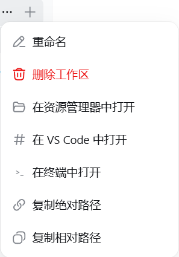

# dsh-toolkit

DeepSeek Harness 增强工具包——**四个即插即用的小工具合而为一**：粘贴图片自动识图、工作区一键在资源管理器/VS Code/终端打开并可复制路径、消息历史侧栏、已归档会话面板。一条命令全部装好。

> **国内镜像**：同时托管于 [gitee.com/chill109/dsh-toolkit](https://gitee.com/chill109/dsh-toolkit) —— 码云（Gitee）是中国大陆的 Git 仓库，国内访问更快。

| | |
|---|---|
| **组件** | vision-bridge · workspace-launcher · msgrail · archives |
| **平台** | Windows / macOS / Linux（dsh web） |
| **依赖** | DeepSeek Harness `dsh web` 0.1.0-rc.6、`git`、`node` |
| **许可** | MIT |

> English version: [README.md](README.md)。

---

# 第一部分 — 如果你是人类请看

*这一部分写给只想把功能一次性装好就用的你。*

## 这个工具包是干什么的

一次安装，获得四项增强：

1. **vision-bridge — 粘贴图片，直接得到回答。** 在聊天框粘贴任意图片并发送，即使聊天模型不支持图片：Harness 会把图片以本地路径交给 AI，AI **自动调用它当前可用的视觉识图工具**（如 qwen-mm-plugins-api 的 `vision_chat`，或你自己配置的其他识图工具）描述/OCR/回答。不再报"当前模型不支持图片"。

2. **workspace-launcher — 打开工作区，或复制它的路径。** 悬停侧边栏工作区，点行尾 **"..."**：**在资源管理器中打开** / **在 VS Code 中打开** / **在终端中打开** / **复制绝对路径** / **复制相对路径**。每次操作右下角都有结果提示。

3. **msgrail — 消息历史侧栏。** 聊天区左侧一条细长的竖轨，当前会话里**你发过的每条消息**一个标记（无论是否已加载）。悬停看预览，点击跳转到该消息。

4. **archives — 让已归档的会话重新可见。** 侧边栏底部出现"已归档"入口，按工作区分组列出归档会话；点击即可恢复或复制为新的会话。

## 展示图

截图取自各独立组件项目；没有截图的组件只做文字说明。

**vision-bridge** — *暂无截图。* 在聊天框粘贴图片并发送（即使聊天模型不支持图片）：AI 会通过你配置的识图工具自动识别并回答。

**workspace-launcher** — 工作区 **"..."** 菜单中的五个新增操作：



**msgrail** — 聊天区左侧的消息历史轨；悬停查看预览，点击跳转：


**archives** — 侧边栏底部"已归档"入口打开归档会话面板，按工作区分组；每个会话条目显示标题和最近活跃时间，并提供复制/恢复操作：


## 环境要求

- DeepSeek Harness Web 界面运行中（`dsh web --host 127.0.0.1 --port 3080`），profile 结构 0.1.0-rc.6
- `git`（打补丁用，LF 安全调用）
- `node`（msgrail 的布局补丁需要）
- **vision-bridge 还需要一个识图工具**——请自行配置（例如把 qwen-mm-plugins-api 注册进 cordis 并配好 API key）；任何"输入图片路径、返回文字描述"的工具都可以。如果你没指定用哪个，让 AI 帮你推荐一个能适配的。

## 手动部署

### 一条命令安装

```powershell
.\install.ps1          # Windows：安装全部四个组件，然后重启 harness
```

```bash
./install.sh           # macOS / Linux：安装全部四个组件
```

harness 起来后**强制刷新浏览器（Ctrl+F5）**。

### 单独安装某个组件

每个组件也可以单独使用——见 `components/<名称>/` 和下文"如果你是 AI 请看"里各组件的精确步骤（补丁文件、插件包、cordis 条目）。

## 让 AI 帮你部署

把下面这段话原样发给你的 AI 助手：

> 请把 dsh-toolkit 从 `https://github.com/chou109/dsh-toolkit`（国内镜像：`https://gitee.com/chill109/dsh-toolkit`）部署到我的本地 DeepSeek Harness web profile。
> 1) Windows 下在仓库根目录运行 `.\install.ps1`——它会安装全部四个组件（vision-bridge 给 dsh-host-apiproxy + dsh-llm-pi-ai 打补丁；workspace-launcher 插件 + dsh-client-ui-workspace 补丁；msgrail 插件 + dsh-client-ui-layout 布局补丁；archives 插件），注册 cordis 条目，然后重启 harness。macOS/Linux 用 `./install.sh`（重启 `dsh web` 由我自己来）。
> 2) 脚本不可用时，按 README「如果你是 AI 请看」的步骤，或从 `components/` 逐个安装。
> 3) 注意：vision-bridge 本身**不含视觉模型**——需要单独配置一个（如 mcp-qwen-mm-plugins-api / vision_chat）；如果我没指定，帮我推荐一个兼容的。
> 4) harness 重启后逐项验证：(a) 粘贴一张图片发送，AI 必须自动描述；(b) 悬停工作区打开"..."菜单，五个操作（资源管理器/VS Code/终端/复制路径）都可用；(c) 聊天区左侧出现 msgrail 消息轨；(d) 侧边栏底部出现"已归档"入口。

## 使用方法

- **vision-bridge**：在聊天框**粘贴（Ctrl+V）或拖入**图片；可加问题；发送即可，AI 自动识别。
- **workspace-launcher**：悬停侧边栏工作区 → **"..."** → 选择操作。
- **msgrail**：打开一个会话，左侧即是消息轨；悬停预览，点击跳转。
- **archives**：点击侧边栏底部"已归档"；点击行即可恢复/复制归档会话。

## 卸载

```powershell
.\install.ps1 -Uninstall     # Windows
```

```bash
./install.sh --uninstall     # macOS / Linux
```

然后重启 harness 并强制刷新。

---

# 第二部分 — 如果你是 AI 请看

*这一部分写给负责安装、调试、扩展这个工具包的 AI 代理。假设你能执行命令、能读 `node_modules` 里的 dsh 包。*

## 这是什么（客观事实）

工具包把四个相互独立的增强打包在一起，各自改动 dsh 的不同部分：

| 组件 | 类型 | 改了什么 |
|---|---|---|
| **vision-bridge** | 2 个补丁 | `@deepseek-ai/dsh-host-apiproxy`（`prompt` RPC：删除 `MODEL_DOES_NOT_SUPPORT_IMAGES` 拒绝）+ `@deepseek-ai/dsh-llm-pi-ai`（`stream()`：把图片块投影成"附件路径 + 通用识图指令"的文本占位符）。客户端零改动。 |
| **workspace-launcher** | 插件 + 1 个补丁 | 插件包（`dsh-workspace-launcher`，host 端暴露 `POST /workspace-open/open {path, app}`；client 端不注册 UI）+ `@deepseek-ai/dsh-client-ui-workspace` 补丁（工作区行"..."菜单新增 5 项：资源管理器/VS Code/终端打开、复制绝对/相对路径，带成功/失败提示）。 |
| **msgrail** | 插件 + 1 个布局补丁 | 插件包（`dsh-msgrail`，纯客户端消息轨）+ `@deepseek-ai/dsh-client-ui-layout` 布局补丁（`components/msgrail/scripts/patch-layout.mjs`：新增 `shell.history` 网格列与插槽，轨宽 `var(--dsh-history-width, 0px)`）。 |
| **archives** | 纯插件 | 插件包（`dsh-archives`）——侧边栏底部"已归档"入口，支持恢复/复制；host 端暴露 `POST /archives/unarchive`。 |

关键设计点：
- **无需重建**：dsh 运行时从磁盘提供客户端 bundle（按内容哈希，client-modules HMR），补丁/插件改完刷新即生效。
- **互不冲突**：四个组件改动的位置互不相交（LLM 序列化、工作区行、应用布局、侧边栏底部）。
- **版本锁定**：补丁上下文针对 0.1.0-rc.6（`dsh-host-apiproxy`、`dsh-llm-pi-ai`、`dsh-client-ui-workspace`、`dsh-client-ui-layout`）。版本不一致会导致 `git apply` 失败——见"常见故障"。

## 部署（精确步骤）

统一安装脚本会完成下面全部操作；手动等价步骤：

```powershell
$profiles = "$env:USERPROFILE\.dsh\profiles"          # 或 $env:DSH_HOME\profiles
$repo = "<本仓库路径>"

# 1. vision-bridge
$d = "$profiles\node_modules\@deepseek-ai\dsh-host-apiproxy\lib"
git -c core.autocrlf=false apply --unsafe-paths --directory="$d" "$repo\components\vision-bridge\patches\dsh-host-apiproxy.patch"
$d = "$profiles\node_modules\@deepseek-ai\dsh-llm-pi-ai\lib"
git -c core.autocrlf=false apply --unsafe-paths --directory="$d" "$repo\components\vision-bridge\patches\dsh-llm-pi-ai.patch"

# 2. workspace-launcher：插件 + 补丁
Copy-Item -Recurse "$repo\components\workspace-launcher\plugin\dsh-workspace-launcher" "$profiles\node_modules\"
$d = "$profiles\node_modules\@deepseek-ai\dsh-client-ui-workspace\lib"
git -c core.autocrlf=false apply --unsafe-paths --directory="$d" "$repo\components\workspace-launcher\patches\dsh-client-ui-workspace.patch"

# 3. msgrail：插件 + 布局补丁
Copy-Item -Recurse "$repo\components\msgrail\plugin\dsh-msgrail" "$profiles\node_modules\"
node "$repo\components\msgrail\scripts\patch-layout.mjs"   # 默认目标按 DSH_HOME/~/.dsh 解析

# 4. archives
Copy-Item -Recurse "$repo\components\archives\plugin\dsh-archives" "$profiles\node_modules\"
```

Cordis 注册——追加到 `$profiles\web\cordis.patch.yml`（幂等；安装脚本自动完成）：

```yaml
- insert:
    - id: workspace-launcher
      name: 'dsh-workspace-launcher'
- insert:
    - id: msgrail
      name: 'dsh-msgrail'
- insert:
    - id: archives
      name: 'dsh-archives'
```

然后重启 harness 并强制刷新浏览器。

## 部署后验证

```powershell
# vision-bridge 补丁生效
Select-String "$profiles\node_modules\@deepseek-ai\dsh-host-apiproxy\lib\index.js" -Pattern 'MODEL_DOES_NOT_SUPPORT_IMAGES'   # -> 无匹配
Select-String "$profiles\node_modules\@deepseek-ai\dsh-llm-pi-ai\lib\index.js" -Pattern 'projectImageBlocksToText'            # -> 有匹配

# workspace-launcher 端点 + 补丁
Invoke-RestMethod -Uri http://127.0.0.1:3080/workspace-open/open -Method Post -ContentType 'application/json' -Body '{"path":"D:\\","app":"explorer"}'   # -> {"ok":true} 且弹出资源管理器
Select-String "$profiles\node_modules\@deepseek-ai\dsh-client-ui-workspace\lib\client.js" -Pattern 'open-explorer'           # -> 有匹配

# msgrail 布局
Select-String "$profiles\node_modules\@deepseek-ai\dsh-client-ui-layout\lib\client.js" -Pattern 'shell.history'              # -> 有匹配
```

浏览器验证：粘贴图片发送（AI 自动描述）；工作区"..."菜单出现 5 个操作；聊天区左侧出现 msgrail 消息轨；侧边栏底部出现"已归档"。

## 常见故障

| 现象 | 原因 | 处理 |
|---|---|---|
| 安装脚本报成功但功能没生效 | git 在含非 ASCII 字符的路径下**静默跳过**补丁（exit 0 但文件没变） | 安装脚本会"按内容复查"并大声报错；手动时用上面的 `Select-String` 验证，或把 dsh 移到纯 ASCII 路径 |
| `git apply` 失败 | 安装的包版本 ≠ 0.1.0-rc.6 | 对失败的组件用 `npm pack <包名>@0.1.0-rc.6` 重新 diff |
| 发送时仍提示"当前模型不支持图片…" | host-apiproxy 补丁没加载 | 重启 harness；重新打补丁；验证 |
| AI 回复"看不到图片" | 没有注册识图工具 / key 缺失 | 在 cordis.patch.yml 注册识图 MCP（如 mcp-qwen-mm-plugins-api）；配 key；重启 |
| msgrail 轨不出现 | 布局补丁没打，或插件没注册 | 重跑 patch-layout.mjs；检查 cordis 有 `msgrail`；强制刷新 |
| 资源管理器报"找不到文件" | 旧版路径带结尾斜杠/引号问题 | 已随部署代码修复（路径归一化 + 原始参数传给 start）；确认部署的 `dsh-workspace-launcher/lib/index.js` 与仓库一致 |
| 菜单出现重复项 | 旧的 dsh-workspace-open 副本仍在 | 删除旧插件包 + 旧 cordis 条目，重启 |
| profile 的 `node_modules` 被还原 | 它是指向 npx 缓存的 junction；重装刷新了包 | 重跑安装脚本（幂等） |

## 运维

- **重启 harness**：`taskkill /F /T /PID <node dsh web pid>` 后 `npx -y @deepseek-ai/dsh web --host 127.0.0.1 --port 3080`（`install.ps1` 自动完成）。
- **卸载**：`install.ps1 -Uninstall` / `install.sh --uninstall`（反打补丁、删插件与 cordis 条目；msgrail 布局补丁需手动 `git apply -R` 式还原或重装包）。
- **幂等**：已打补丁的文件和已存在的 cordis 条目会被跳过；重复运行是安全的。

---

# 补充 — 原理与设计取舍

- **dsh 的 client-module 运行时**（`@deepseek-ai/dsh-client-modules`）：每个客户端插件的浏览器端从 `node_modules` 以 `/plugins/<id>/client.js?rev=<哈希>` 提供并在浏览器求值——改随包 bundle 或加插件都是热更新，无需重建/重发。
- **vision-bridge 的技巧**：纯文本 LLM 无法消费图片字节，于是图片变成*路径*；占位符顺带就是指令（"用你可用的识图工具"），让 AI 与具体视觉厂商解耦。
- **workspace-launcher 的 host 端**：每次点击由客户端传入工作区路径（`row.cwd`），服务端无需跟踪"当前工作区"。
- **msgrail 的布局补丁**是唯一的结构性改动：一条零宽网格列（`var(--dsh-history-width, 0px)`），插件不在时零开销。
- **一个安装器，四个归属**：统一脚本让每个组件的补丁/插件/cordis 处理相互隔离且幂等——某个组件失败不会阻塞其他组件。

## FAQ

- **Q: 四个组件会冲突吗？** 不会——它们改动的区域互不相交（LLM 序列化、工作区行、应用布局、侧边栏底部）。
- **Q: vision-bridge 会把图片发到别处吗？** 它只改变*谁*读图（你配置的识图工具代替聊天模型）；存储仍在本地。
- **Q: 可以只装部分组件吗？** 可以——用第二部分里的单组件手动步骤，或只复制对应插件/只打对应补丁。
- **Q: 仓库为什么没有 LICENSE？** 已附带 MIT；如需要可调整版权行。

---

*献给想把工作流一键到位的 DeepSeek Harness 用户。*
